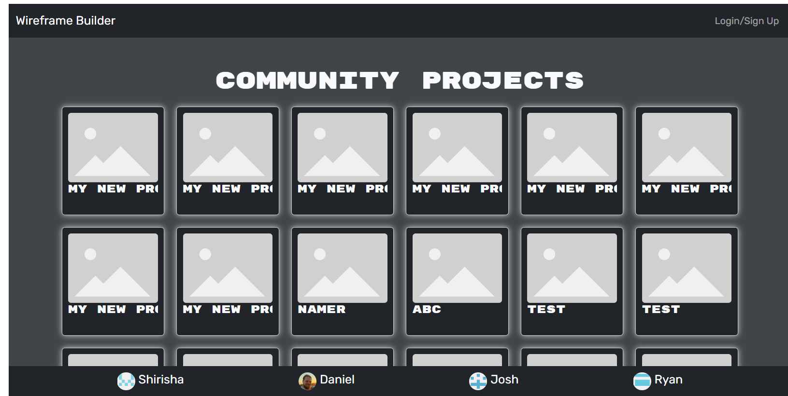
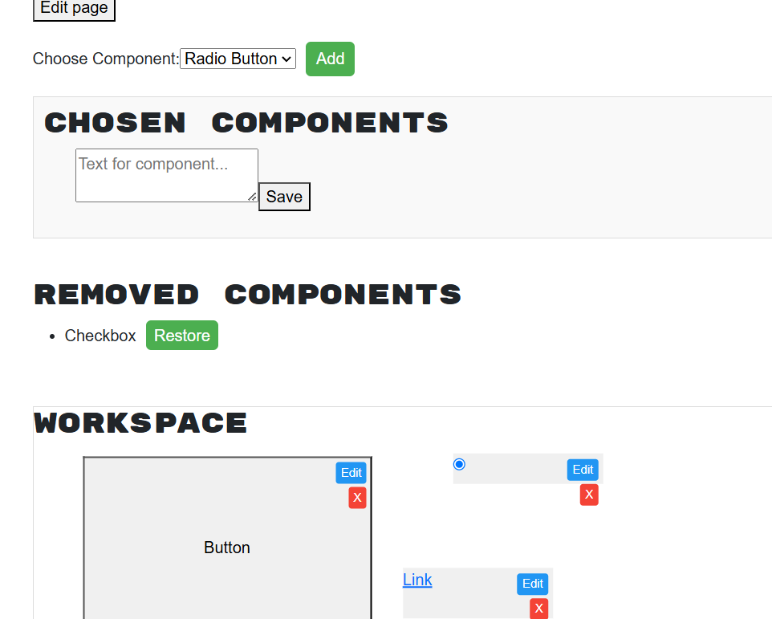

# WIREFRONT – Mock Web Page Builder

## Project Overview

Wirefront is a Mock Web Page Builder designed to help you create rough layouts and structures for websites quickly. This tool allows you to use pre-designed components to assemble a basic idea of website layouts and functionalities. The aim is not to build a fully functional website but to provide a fast and rigid way to visualize website structures.


The tool is built with JWT authentication for user sign-ins, and the projects are viewable only after logging in. The main goal is to simplify and expedite the process of creating and organizing pages, components, and projects for a website.


## Key Features

User Authentication: Sign up, login, and manage your personal projects securely using JWT authentication.
Project Management: Create, update, and delete projects.
Page Management: Add, edit, and remove pages associated with projects.
Component Management: Drag, drop, scale, and delete components on pages.
Pre-designed Components: Includes components like textboxes, headers, buttons, footers, checkboxes, and more.
Styling: Various style sets to customize the appearance of components.

## User Story

```md
AS A user
I WANT to be able to sign in, create projects, add pages, and manage components
SO THAT I can quickly visualize website layouts for faster development

## Acceptance Criteria

```md
GIVEN a Mock Web Page Builder application
WHEN a user signs in
THEN they are able to view and manage their personal projects

GIVEN the ability to manage projects
WHEN the user creates a new project
THEN a default project is created and displayed in the project dashboard

GIVEN the ability to manage pages within a project
WHEN the user creates a new page
THEN the page will be created with default settings for name, width, and height

GIVEN the ability to add, edit, and delete components within a page
WHEN the user adds a new component
THEN the component is created with default settings (e.g., type, width, height, x, and y position)

GIVEN the ability to move, scale, and delete components
WHEN the user drags a component to add it to a page
THEN they can move, resize, and delete the component as needed

GIVEN the ability to view project pages
WHEN the user clicks on a project
THEN they can see a list of pages within that project

GIVEN a secure authentication system
WHEN the user logs in
THEN they receive a JWT token that allows them to access and manage their projects, pages, and components

## User Interface

Dashboard: Displays all personal projects when logged in, and random projects when logged out.
Sign Up: Allows users to create an account.
Login: Authenticates users via JWT.
Project Settings: Edit the project name and manage pages.
Page Editor: Edit pages by dragging, dropping, resizing, and managing components.
Project Preview: Preview the layout before deployment.

## Getting Started

To get your WIREFRONT project up and running, you will need to set up both the back-end (Python with Flask) and the front-end (React). The back-end handles all the API logic, database interactions, and authentication, while the front-end enables users to interact with the system.

### Back-End Specifications
The back-end of this application is built with Python and Flask. You will need to set up and modify several files in the back-end to ensure it works with the front-end.

1. Create a requirements.txt file with dependencies
2. Install Dependencies
3. Set Up the Flask App
4. Create Models 
5. Implement Routes
6. Setup JWT Authentication

### Front-End Specifications
For the front-end, the following files will need to be created and modified to ensure smooth interaction with the back-end API.

1. Install Dependencies
2. Set Up the React App
3. Integrate Authentication
4. Handle Projects, Pages, and Components

## Technologies Used
Frontend: HTML, CSS, JavaScript
Backend: Node.js, Express,Python
Database: MongoDB
Authentication: JWT (JSON Web Tokens)

## Contributors
Daniel Young: Backend development
Ryan Schwark: Login and Signup page with CSS
Josh: Draggable components,projects ,page and style options
Shirisha: Page editor and CSS styling

## Deployed URL
https://wirefront-main.onrender.com
